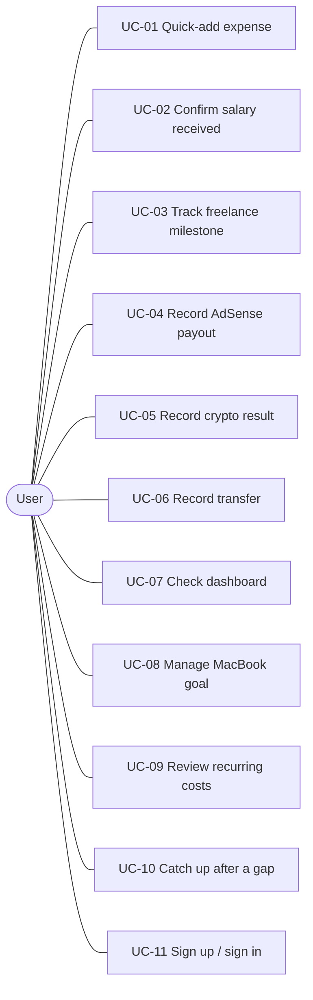

# FundTrail — Software Requirements Specification (SRS)

| | |
|---|---|
| **Product** | FundTrail — personal finance management for Android |
| **Document** | `Docs/srs.md` |
| **Version / status** | 1.1 — Draft for team review |
| **Date** | 2026-10-06 |
| **Issue** | EPIC-001 / T2 (#5) · Sub-issues: #6, #7 · Parent: #1 |
| **Source documents** | (1) SE3092 Assignment 01 specification and marking scheme; (2) FundTrail Scenario Analysis (rows `A-01`…`A-24`) |
| **Format rule** | Markdown only, so it diffs in PRs. PDF export is an M4 concern. |

**How to use this document.** Every requirement has a stable ID. `FR-xx` = functional, `NFR-xx` = non-functional, `CON-xx` = constraint, `BR-xx` = business rule, `D-xx` = decision, `UC-xx` = use case. IDs are never reused or renumbered. When a requirement is dropped, mark it `~~struck~~ (withdrawn)` instead of deleting it. Code, tests, ADRs and PR descriptions cite these IDs.

---

## 1. Introduction

### 1.1 Purpose
This SRS defines what FundTrail must do, how well it must do it, and what limits the team must work within. It is written so the team can design, build and test without further interpretation of the scenario.

### 1.2 Product vision
Kavindu Silva, 25, a junior software engineer in Colombo, earned over LKR 1.6M in twelve months and has LKR 11,200 saved. Four tracking tools failed him because they were too manual, too narrow in their data model, gave nothing back, or punished gaps in use. FundTrail's core promise: **recording a transaction costs seconds, and the app immediately returns insight about where he stands against his MacBook goal.**

### 1.3 Scope
**In scope (v1):** email/password (and optionally Google) sign-in; accounts; categories with committed/discretionary type; fast manual expense entry; multi-source, multi-currency income with expected vs received tracking; freelance project/milestone tracking; transfers; recurring costs; one savings goal with computed progress; a dashboard; offline use with automatic sync.

**Out of scope (v1):** automatic bank import or SMS parsing; shared or multi-user budgets; live exchange-rate feeds (the user supplies the rate, see D-03); trading or portfolio valuation (only realised crypto results are recorded); tax calculation; iOS or web clients; tablet-optimised layouts.

### 1.4 Intended readers
Developers (design and build), the tester (acceptance criteria), the markers (traceability to the scenario), and the demo presenters.

### 1.5 Definitions

| Term | Meaning |
|---|---|
| **Received** | Money that has actually arrived. Only received amounts count towards actual income. |
| **Expected / pending** | Money the user anticipates (salary on the 25th, an invoice milestone). Never counted as income until confirmed. |
| **Committed** | Spending the user cannot easily avoid month to month (rent, utilities, gym, subscriptions, groceries). |
| **Discretionary** | Spending by choice (coffee and dining, ride-hailing, food delivery, shopping). |
| **Transfer** | Money moved between the user's own accounts (for example bank → cash, bank → Binance). Not income, not expense. |
| **Account** | One of the user's "pots": main bank, secondary bank, cash, Binance, other. |
| **Net saving (month)** | Received income − expenses for the month. Transfers excluded (BR-05). |
| **Contribution** | An amount the user earmarks to the goal. It does not change net saving. |
| **LKR** | Sri Lankan rupee, the base currency. |
| **Reference device** | An Android 8.0 (API 26) phone with 3 GB RAM, used for performance targets. |

### 1.6 References
- SE3092 Assignment 01 — specification and marking scheme (issued 23/09/2026).
- FundTrail Scenario Analysis — Part 1 (`A-01`…`A-24`) and Part 2 (five lenses).
- ADRs (technology choices are recorded there, for example ADR-004 for synchronisation).

---

## 2. Overall description

### 2.1 User
There is a single user class: an individual who tracks their own money. The design persona is Kavindu Silva.

| Persona fact | Consequence for the product |
|---|---|
| Salary LKR 120,000–140,000, paid on the 25th, varies with performance pay | Expected vs received salary (FR-49) |
| Freelance LKR 20,000–90,000 per project, milestone-based, irregular | Project and milestone tracking with overdue status (FR-50…FR-53) |
| AdSense paid monthly in USD, about LKR 3,500–19,000 | Store USD, rate and LKR received (FR-54) |
| Crypto trading (USDT, ETH, altcoins) with a Q1 gain and a Q3 loss | Signed realised entries and a year-to-date net (FR-55) |
| Rent LKR 34,000; utilities vary; gym auto-debit; unwanted subscriptions | Recurring templates with expected vs actual (FR-65…FR-69) |
| Goal: MacBook Pro M4 at about LKR 490,000 within 12 months, LKR 11,200 saved | Required saving ≈ LKR 39,900 per month (BR-06) |
| Impulsive on discretionary spend, optimistic about income, avoidant about expenses | Neutral tone, received-only projections, goal cost shown at entry (FR-41, NFR-14) |
| Quit every tool within two weeks | Gap tolerance, low friction, instant insight (FR-105, NFR-01) |

### 2.2 Product perspective
FundTrail is a standalone Android app (single activity) backed by Firebase Authentication and Cloud Firestore. It has no other external system interfaces. Architecture is MVVM: UI (Compose) → ViewModel → Repository → data sources (Firestore, Room cache).

### 2.3 Use cases

| UC | Goal | Main requirements |
|---|---|---|
| UC-01 | Log a spend in seconds, see goal impact | FR-30…FR-41 |
| UC-02 | Replace "expected" salary with the amount actually deposited | FR-49, FR-56 |
| UC-03 | Create a project, set milestones, mark received, chase overdue | FR-50…FR-53 |
| UC-04 | Record monthly AdSense in USD with rate and LKR received | FR-54, FR-48 |
| UC-05 | Record a realised gain or loss, see year-to-date net | FR-55 |
| UC-06 | Move money between own accounts without distorting totals | FR-60…FR-62 |
| UC-07 | See received, spent, saved, goal status, split and top categories | FR-90…FR-99 |
| UC-08 | Set or adjust the goal; see required vs actual saving and feasibility | FR-75…FR-84 |
| UC-09 | See recurring costs; confirm due items; review subscriptions | FR-65…FR-70 |
| UC-10 | Return after days or weeks and back-fill without guilt | FR-35, FR-36, FR-105, FR-106 |
| UC-11 | Create an account, sign in, stay signed in | FR-01…FR-08 |

### 2.4 Operating environment
Android 8.0 (API 26) and above, target SDK 34 or higher, phones in portrait, 360–480 dp widths. Network is intermittent and the app must remain usable offline.

### 2.5 Assumptions
- **AS-01** The user records money manually; there is no bank feed.
- **AS-02** The user has one device at a time for entry, but may sign in on several. Data syncs through Firestore.
- **AS-03** All reporting is in LKR. The user can read the LKR value actually received for foreign-currency items.
- **AS-04** The user's calendar month and local time are Asia/Colombo (UTC+05:30) (NFR-23).

---

## 3. Constraints

Constraints are fixed. They are not negotiable inside the project. Technology choices that are not listed here are recorded in ADRs.

### 3.1 Technical constraints (from the assignment)

| ID | Constraint | Source |
|---|---|---|
| CON-01 | The application is 100% Kotlin. No Java in the application layer. Gradle uses the Kotlin DSL. | Assignment §4.3, §5 |
| CON-02 | All UI is Jetpack Compose with Material Design 3 components. No XML layouts. | §4.3, §5 |
| CON-03 | Single-activity architecture using Navigation Compose, with typed arguments preferred. | §5 |
| CON-04 | MVVM is strictly observed: UI → ViewModel → Repository → Model. No ViewModel logic in Composables. No data-layer calls from the UI layer. | §4.3, §5 |
| CON-05 | ViewModels expose `StateFlow` or `LiveData` only. No raw mutable state is exposed to the UI. | §5 |
| CON-06 | Asynchronous work uses Kotlin Coroutines. `viewModelScope` is used for ViewModel async operations. | §5 |
| CON-07 | Dependency injection uses Hilt (preferred) or Koin. No manual ViewModel instantiation inside Composables. | §5 |
| CON-08 | Identity is managed by Firebase Authentication. Email/password is mandatory. Google Sign-In is bonus. Hard-coded user data earns zero for the Firebase criterion. | §4.3, §5 |
| CON-09 | Cloud Firestore is the primary persistence layer, with real-time listeners on the dashboard. | §4.3, §5 |
| CON-10 | Firestore Security Rules are written, tested and submitted as `firestore.rules`. | §4.3, §7 |
| CON-11 | Local caching with Room is strongly recommended. Offline persistence must not block the UI on network unavailability. How Room and Firestore's own offline cache combine is decided in ADR-004. | §5 |
| CON-12 | Minimum SDK 26 (Android 8.0). Target SDK 34 or higher. The APK must install and run on Android 8.0+. | §4.3, §5 |
| CON-13 | All basic error states are handled: no unhandled exceptions, no blank screens on network failure, no crashes on empty datasets. | §4.3 |
| CON-14 | The submitted APK connects to a live Firebase project. Local emulator configurations are not acceptable. | §6.3 |
| CON-15 | The app contains no hard-coded user financial data. Scenario figures may appear only in tests and documentation. | §4.3 |

### 3.2 Project and process constraints

| ID | Constraint | Source |
|---|---|---|
| CON-16 | Submission deadline is 30/10/2026 (LMS upload, then a scheduled 15-minute live demo). | Header, §6.4 |
| CON-17 | Group of at most 3 members. | Header |
| CON-18 | Private GitHub or GitLab repository with a genuine, iterative commit history. | §6.1 |
| CON-19 | `README.md` contains: project overview, Firebase configuration steps, build instructions, and an architectural summary. | §6.1 |
| CON-20 | The Technical Design Document is a professionally formatted PDF of at least 15 pages. It covers requirements analysis, Firestore schema, MVVM diagram, annotated wireframes and design justifications, and refers to this scenario and this implementation specifically. | §6.2 |
| CON-21 | At least three annotated wireframes or mockups cover the screens most critical to the daily experience. | §4.2 |
| CON-22 | Deliverables also include a use case diagram, MVVM folder structure, a Firestore schema diagram, and the security rules file (marking scheme). | Rubric |
| CON-23 | AI tools may be used as a learning aid, but all code, design decisions and documentation must be the team's own work, and any AI assistance must be disclosed. Code sharing and plagiarism of open-source finance apps are academic-integrity violations. | §6.4 |
| CON-24 | This SRS stays in Markdown for PR diffs. PDF export is handled later (M4). | Issue notes |

---

## 4. Business rules

These rules define the calculations. Each is deterministic and unit-tested (NFR-19).

| ID | Rule |
|---|---|
| BR-01 | The base currency is LKR. All totals, ratios and goal figures are in LKR. |
| BR-02 | Money is stored as integer minor units (cents of LKR or of the original currency), never as floating point. Display rounds to whole LKR. |
| BR-03 | **Rate lock.** A foreign-currency entry stores original currency, original amount, LKR received, and the derived rate (LKR ÷ original). It is never recomputed from a newer rate. |
| BR-04 | **Actual income** for a period = sum of LKR values of income entries with status *received* in that period. Crypto entries are signed and count at their net. Expected, pending and overdue items count as zero. |
| BR-05 | **Net saving (month)** = actual income − expenses. Transfers are excluded. Contributions do not alter it. |
| BR-06 | **Required monthly saving** = (goal target − goal saved) ÷ M, where M = max(1, ⌈days to deadline ÷ 30.4375⌉). *Check: (490,000 − 11,200) ÷ 12 = 478,800 ÷ 12 = LKR 39,900.* |
| BR-07 | **Goal saved** = opening saved amount + sum of contributions. |
| BR-08 | **Saving pace** = mean net saving of the last up to 3 completed months. If none exist, net saving of the current month to date. Projections use the pace calculated with crypto excluded unless the user turns crypto on (FR-83). |
| BR-09 | **Projected completion** = today + (goal target − goal saved) ÷ pace months, shown only if pace > 0. **Status:** *ahead* if projected completion is at least 1 month before the deadline; *on track* if it is on or before the deadline; *behind* if it is after the deadline or pace ≤ 0. The status always shows the gap in LKR per month (required − pace). |
| BR-10 | **Infeasible goal** when required monthly saving > 40% of average monthly received income (same window as BR-08, crypto excluded by default). The 40% and the 30% offer rate below are named constants in one config file, and the team confirms them in review (D-05). *Check: 39,900 ÷ at least 133,000 ≈ 30%, so the MacBook goal is demanding but not flagged infeasible.* |
| BR-11 | **Adjustment offers** when infeasible: (a) new deadline = ⌈remaining ÷ (30% × average income)⌉ months from today; (b) reduced target = saved + 30% × average income × M. The user chooses one, edits the goal manually, or dismisses. |
| BR-12 | **Goal cost of a spend** = amount ÷ goal target (as %) and amount ÷ required monthly saving (as %). *Check: LKR 24,000 → 4.9% of the MacBook and 60.2% of one month's required saving.* |
| BR-13 | **Expense type** = transaction-level override if set; otherwise the category's type (committed or discretionary). *Uncategorised* defaults to discretionary so unknown spending stays visible. |
| BR-14 | A **transfer** has a from-account, a to-account and an amount. It is excluded from income, expense, net saving and the committed/discretionary split. Account balances reflect it. |
| BR-15 | **Milestone status:** *pending* until received; *overdue* automatically when the due date has passed and it is not received; *received* when the user confirms the payment. A received payment links to exactly one milestone. |
| BR-16 | **Expected vs actual** (salary, rent, utilities, other recurring items): an expected amount is a template value. The actual is entered at confirmation. Variance = actual − expected. Only confirmed actuals are counted. |
| BR-17 | **Crypto net position (year-to-date)** = sum of signed realised entries since 1 January. Moves into or out of Binance are transfers (BR-14). |
| BR-18 | Deleting a record soft-deletes it so it can be undone. All reports exclude soft-deleted records. |
| BR-19 | Months are calendar months in Asia/Colombo. Timestamps are stored in UTC. |

---

## 5. Functional requirements

**Priority:** **M** = Must (needed for the demo build), **S** = Should, **C** = Could.
**Trace** points to scenario-analysis rows (`A-xx`). Every requirement is phrased as "the system shall".

### 5.1 Authentication and onboarding

| ID | Requirement | Pri | Trace | Acceptance criterion |
|---|---|---|---|---|
| FR-01 | The system shall let a new user register with email and password through Firebase Authentication. | M | CON-08 | Valid credentials create an account and open onboarding. Invalid or duplicate email shows a specific message. |
| FR-02 | The system shall let a registered user sign in with email and password. | M | CON-08 | Correct credentials open the dashboard. Wrong credentials show an error without clearing the email field. |
| FR-03 | The system shall let the user sign out. | M | A-20 | After sign-out the sign-in screen opens, locally cached data is cleared from the device, and no user data remains visible. |
| FR-04 | The system shall send a password-reset email on request. | S | A-20 | Entering a registered email shows a confirmation. |
| FR-05 | The system shall offer Google Sign-In. | C | CON-08 | Google sign-in creates or opens the same per-user data space. |
| FR-06 | The system shall keep the user signed in across restarts and open straight to the dashboard. | M | A-20 | After a force-stop and relaunch the dashboard opens with no sign-in prompt. |
| FR-07 | The system shall scope every record to the signed-in user's `uid`. | M | A-20, CON-15 | A second account never sees the first account's data. |
| FR-08 | The system shall run an onboarding of at most three skippable steps (goal, accounts, optional income estimate) and reach the dashboard even if every step is skipped. | M | A-03, A-20 | Skipping everything lands on a working dashboard with an empty-state prompt, not an error. |

### 5.2 Accounts

| ID | Requirement | Pri | Trace | Acceptance criterion |
|---|---|---|---|---|
| FR-10 | The system shall create five default accounts on first sign-in: main bank, secondary bank, cash, Binance, other. | M | A-10 | The five accounts exist and are selectable in every entry form. |
| FR-11 | The system shall let the user add, rename and archive accounts. | S | A-10 | An archived account is hidden from entry forms but its history stays visible. |
| FR-12 | The system shall show a per-account balance = optional opening balance + income − expenses ± transfers. | S | A-10, A-21 | After a transfer of X from cash to bank, cash falls by X and bank rises by X. |

### 5.3 Categories

| ID | Requirement | Pri | Trace | Acceptance criterion |
|---|---|---|---|---|
| FR-20 | The system shall seed default categories with local relevance and a default type (see Appendix A). | M | A-11, A-18 | Ride-hailing, food delivery and coffee and dining exist on first launch. |
| FR-21 | The system shall let the user create, rename and archive categories. | M | A-11 | A new category is available in quick-add straight away. |
| FR-22 | The system shall let the user override the committed/discretionary type per category, and per transaction. | M (category), S (transaction) | A-18 | Changing a category's type changes the split view without editing past entries' overrides. |
| FR-23 | The system shall suggest a category from the last-used category and from matching note or merchant text. | S | A-11 | Typing "PickMe" suggests Ride-hailing. |
| FR-24 | The system shall remember a correction: if the user changes a suggestion for a merchant text, that choice is suggested next time. | S | A-11 | After one correction the same text suggests the corrected category. |
| FR-25 | The system shall treat a suggestion only as a pre-selected chip the user can change. It shall never assign a category silently. | M | A-11 | The chip is visibly selected and one tap changes it before save. |

### 5.4 Expense entry

| ID | Requirement | Pri | Trace | Acceptance criterion |
|---|---|---|---|---|
| FR-30 | The system shall provide quick-add reachable in one tap from the dashboard, opening with the amount field focused and a numeric keypad. | M | A-02 | From the dashboard, one tap shows the keypad with the cursor in the amount field. |
| FR-31 | The system shall default date and time to now, the account to the last used, the category to the suggestion, and the type from the category. | M | A-02 | A second entry preselects the previous entry's account. |
| FR-32 | The system shall require only the amount. A missing category saves as *Uncategorised*. | M | A-02 | An entry with only an amount saves successfully. |
| FR-33 | The system shall show category chips matching the user's real spending, most-used first. | M | A-02, A-11 | Chips order by usage over the last 30 days. |
| FR-34 | The system shall store each expense as a structured record: amount, date/time, category, expense type, account, optional note or merchant, recurring flag and template id. | M | A-08 | Every saved expense has all required fields in the data store. |
| FR-35 | The system shall allow back-dating to any past date. | M | A-03 | A past date saves and appears in the correct month. |
| FR-36 | The system shall offer *Save and add another*, which keeps date and account for fast catch-up. | S | A-03 | After saving, a fresh form opens with date and account unchanged. |
| FR-37 | The system shall let the user edit and delete entries, with an undo option after delete. | M | A-02 | Undo within the snackbar window restores the entry and its totals. |
| FR-38 | The system shall support a foreign-currency expense: original currency, original amount, LKR value, and the derived rate (BR-03). | S | A-04 | A USD 10 expense recorded as LKR 3,100 stores a rate of 310. |
| FR-39 | The system shall allow entry fully offline and sync it later. | M | A-05 | In airplane mode an entry saves and appears in totals. After reconnecting it appears in Firestore. |
| FR-40 | The system shall offer an optional daily reminder at a user-chosen time, off by default. | S | A-02 | With no time chosen, no notification is sent. |
| FR-41 | The system shall show, on saving a discretionary expense, its goal cost per BR-12 in a neutral message. | M | A-23 | Saving LKR 24,000 shows "≈4.9% of your MacBook goal · 60% of this month's required saving". |

### 5.5 Income

| ID | Requirement | Pri | Trace | Acceptance criterion |
|---|---|---|---|---|
| FR-45 | The system shall model income sources, each with type (salary, freelance, AdSense, crypto, other), cadence, currency, optional expected amount and optional expected day. | M | A-06 | The user can create the four scenario sources with different currencies and cadences. |
| FR-46 | The system shall suggest creating the four typical sources during onboarding. | S | A-06 | The suggestions are skippable. |
| FR-47 | The system shall record received income: source, original amount and currency, LKR received, derived rate, date and account. | M | A-04, A-06 | A USD entry stores both USD and LKR values. |
| FR-48 | The system shall never recompute a stored LKR value or rate when other entries change or when time passes. | M | A-04, A-14 | Adding a new USD entry at a different rate leaves old entries unchanged. |
| FR-49 | The system shall create an expected salary entry on the expected day and let the user confirm it by entering the received amount, showing the variance from expected. | M | A-12 | Confirming LKR 134,500 against an expected 130,000 shows +4,500 and counts 134,500 as income. |
| FR-50 | The system shall let the user create freelance projects with a name, optional client, total agreed amount and milestones (amount, due date). | M | A-13 | A project with three milestones saves and lists them. |
| FR-51 | The system shall mark a milestone *overdue* automatically when its due date passes without receipt (BR-15). | M | A-13 | A milestone due yesterday and unreceived shows as overdue the next time the app opens. |
| FR-52 | The system shall let the user mark a milestone received, creating an income entry linked to that project and milestone. | M | A-13 | The income entry shows which project and milestone it paid. |
| FR-53 | The system shall send a follow-up reminder for an overdue milestone. | S | A-13 | The overdue invoice produces one local notification, and not more than once per week. |
| FR-54 | The system shall support a monthly AdSense entry (USD amount, rate, LKR received). It may be saved as *pending estimate* and later confirmed with the credited amount. | M | A-14 | A pending estimate counts as zero income until confirmed (see D-02). |
| FR-55 | The system shall record crypto as signed realised results (gain or loss) and show a running year-to-date net position. | M | A-15 | Entering +80,000 and −30,000 shows a net of +50,000. |
| FR-56 | The system shall count only received amounts as income, and show expected, pending and overdue amounts separately. | M | A-12, A-13, A-07, A-23 | The pending strip lists them and the income total excludes them. |
| FR-57 | The system shall compute actual monthly income from received entries and show: this month, a trailing 3-month average, and a range (lowest to highest of the last up to 6 months). | M | A-16, A-01, A-07 | With three months of entries all three figures appear and match hand calculation. |
| FR-58 | The system shall let the user enter their own monthly estimate (low–high) and show it beside the computed figure. | M | A-16 | An estimate of 160,000–210,000 displays next to the computed value. |
| FR-59 | The system shall show income by source for the selected month. | S | A-16 | Source amounts sum to the month's actual income. |

### 5.6 Transfers

| ID | Requirement | Pri | Trace | Acceptance criterion |
|---|---|---|---|---|
| FR-60 | The system shall record a transfer between two of the user's accounts (amount, date). | M | A-21 | A transfer with the same from and to account is rejected with a message. |
| FR-61 | The system shall exclude transfers from income, expense, net saving and the committed/discretionary split, and show them in history with a distinct type. | M | A-21 | A LKR 20,000 cash withdrawal changes no monthly total. |
| FR-62 | The system shall treat moving money into or out of Binance as a transfer. | M | A-15, A-21 | A Binance deposit does not change income or expense. |

### 5.7 Recurring costs

| ID | Requirement | Pri | Trace | Acceptance criterion |
|---|---|---|---|---|
| FR-65 | The system shall store recurring templates: name, category, expected amount, cadence (weekly, monthly, yearly), due day, account and type. | M | A-17 | Rent LKR 34,000 on the 1st saves as a monthly committed template. |
| FR-66 | The system shall surface a due recurring item as a prompt. One tap confirms it, with the amount editable. Unconfirmed items are not counted. | M | A-22 | Confirming rent at 37,500 (utilities included) counts 37,500. |
| FR-67 | The system shall store expected and actual for each confirmed recurring item and show the variance. | M | A-22 | History shows both amounts and the difference. |
| FR-68 | The system shall show a list of recurring costs with a combined monthly total. | M | A-17 | The total equals the sum of active templates normalised to monthly. |
| FR-69 | The system shall prompt a "still using this?" review for each subscription every 90 days (configurable), with options keep, remind me to cancel, and end. | S | A-17 | *End* stops future prompts and keeps history. |
| FR-70 | The system shall let the user pause or end a template without deleting past instances. | S | A-17 | A paused template creates no new prompts. |

### 5.8 Savings goal

| ID | Requirement | Pri | Trace | Acceptance criterion |
|---|---|---|---|---|
| FR-75 | The system shall let the user create and edit one active goal: name, target (LKR), deadline, and amount already saved. | M | A-19 | Goal 490,000 with 11,200 saved and a deadline 12 months out saves. |
| FR-76 | The system shall compute and show the required monthly saving per BR-06, recalculated whenever saved amount or date changes. | M | A-19, A-01 | The scenario goal shows LKR 39,900. |
| FR-77 | The system shall show the saving pace (BR-08) next to the required figure. | M | A-19 | Both figures appear on the same card. |
| FR-78 | The system shall show a status (ahead, on track, behind) and the LKR-per-month gap (BR-09). | M | A-19 | A pace of 20,000 against a required 39,900 shows *behind* by LKR 19,900 per month. |
| FR-79 | The system shall show the projected completion date at the current pace against the deadline. | M | A-19 | With pace ≤ 0 the card says no projection is available yet instead of a date. |
| FR-80 | The system shall let the user record contributions to the goal (amount, date). | S | A-19 | A contribution of 10,000 raises *saved* by 10,000 and does not change net saving. |
| FR-81 | The system shall detect an infeasible goal (BR-10), show the gap, and offer the adjustments in BR-11. | M | A-24 | A required saving above 40% of average income shows a banner with both offers. |
| FR-82 | The system shall keep a revision history when the target or deadline is edited, and keep progress. | S | A-24 | Editing the target keeps the saved amount and logs the old value. |
| FR-83 | The system shall let the user include or exclude crypto from the projection basis (default excluded). | S | A-23 | Toggling recalculates pace and status. |
| FR-84 | The system shall mark the goal reached and archive it, with a neutral confirmation. | C | A-19 | A reached goal moves to an archive and a new goal can be created. |

### 5.9 Insights

| ID | Requirement | Pri | Trace | Acceptance criterion |
|---|---|---|---|---|
| FR-90 | The system shall open on a dashboard that answers "where do I stand?" without further navigation. | M | A-20 | After sign-in the first screen shows FR-91…FR-94. |
| FR-91 | The dashboard shall show month summary: received, spent, saved. | M | A-01, A-09 | Figures equal the sum of the month's records. |
| FR-92 | The dashboard shall show a goal progress card with required vs actual saving, status and gap. | M | A-19 | The card shows the values defined in FR-76…FR-79. |
| FR-93 | The dashboard shall show a committed vs discretionary split (donut or stacked bar). | M | A-18 | Segments follow BR-13, and transfers are absent. |
| FR-94 | The dashboard shall show a ranked category breakdown for the month. | M | A-18 | A LKR 24,000 coffee and dining month ranks according to its total. |
| FR-95 | The dashboard shall show a secondary recurring-costs summary. | S | A-17 | It links to the full list in FR-68. |
| FR-96 | The dashboard shall update immediately after each change, using real-time listeners together with local state. | M | A-09, A-01 | A saved entry changes the totals within 1 second without manual refresh. |
| FR-97 | The dashboard shall be useful with one day of data and shall never show an "incomplete" or "failed" state. | M | A-03, A-09 | With one entry the dashboard shows meaningful figures and no warnings about missing data. |
| FR-98 | The dashboard shall allow switching between months. | S | A-09 | Previous months show their own totals. |
| FR-99 | The dashboard shall show a compact strip of pending items: expected salary, overdue milestones, due recurring items. | M | A-12, A-13, A-22 | Each item has a one-tap action to confirm. |

### 5.10 History

| ID | Requirement | Pri | Trace | Acceptance criterion |
|---|---|---|---|---|
| FR-100 | The system shall list all transactions (expense, income, transfer) newest first, grouped by day, with pagination. | M | A-08 | Each row shows type, amount, category or source, and account. |
| FR-101 | The system shall filter the history by type, account, category, source and date range. | S | A-10 | A filter returns only matching records. |
| FR-102 | The system shall search history by note or merchant text. | C | A-11 | Searching "gym" lists matching entries. |

### 5.11 Gap tolerance

| ID | Requirement | Pri | Trace | Acceptance criterion |
|---|---|---|---|---|
| FR-105 | After 7 or more days without an entry, the system shall show a neutral welcome-back message with a one-tap path to catch-up entry. | M | A-03 | The message contains no failure language, counts or blame. |
| FR-106 | The system shall not use streaks, missed-day counters or "incomplete month" indicators anywhere. | M | A-03 | A review of all screens finds none. |

### 5.12 Reliability, errors and settings

| ID | Requirement | Pri | Trace | Acceptance criterion |
|---|---|---|---|---|
| FR-110 | The system shall show sync state (offline, syncing, synced) unobtrusively. | S | A-05 | Going offline changes the indicator within 5 seconds. |
| FR-111 | The system shall show an actionable message with retry for every failed operation. | M | CON-13 | A simulated Firestore failure shows a message and a retry, never a blank screen or crash. |
| FR-112 | The system shall provide an empty state for every list and chart. | M | CON-13 | A new account opens every screen without crashing. |
| FR-113 | The system shall validate form input with inline messages (amount > 0, valid date, required fields). | M | CON-13 | Entering 0 or text in an amount field blocks save with a message. |
| FR-115 | The system shall provide settings for reminder time, income estimate, subscription-review interval and the crypto toggle. | M | A-02, A-16 | Changes persist across restarts. |
| FR-116 | The system shall export all of the user's records as CSV. | C | A-08 | The file opens in a spreadsheet with one row per transaction. |
| FR-117 | The system shall let the user delete their account and all their data. | S | A-20 | After deletion no Firestore documents remain for that `uid`. |
| FR-118 | The system shall follow the system light or dark theme. | S | A-20 | Switching the system theme switches the app. |

---

## 6. Non-functional requirements

| ID | Category | Requirement | Verification |
|---|---|---|---|
| NFR-01 | Performance | From the dashboard, saving a basic expense shall take at most 3 taps (open quick-add, type amount, save) and about 10 seconds. | Task test with stopwatch |
| NFR-02 | Performance | Cold start to a populated dashboard shall be at most 2.5 s on the reference device with cached data. | Timed launch, 5 runs |
| NFR-03 | Performance | Dashboard figures shall recompute within 300 ms of a local write on the reference device. | Instrumented test |
| NFR-04 | Performance | History shall load in pages of 50 and scroll smoothly with 5,000 entries. | Seeded-data test |
| NFR-05 | Offline | All create, edit, delete and read operations on cached data shall work with no network. Queued writes shall sync within 30 seconds of connectivity returning. | Airplane-mode test |
| NFR-06 | Integrity | Money shall be integer minor units. Sums shall be exact. Rounding applies at display only (BR-02). | Unit tests |
| NFR-07 | Integrity | Records shall use client-generated IDs so retried writes are idempotent. | Code review, test |
| NFR-08 | Integrity | Concurrent edits shall resolve last-writer-wins per document using the server timestamp. Distinct records never overwrite each other. | Two-device test |
| NFR-09 | Reliability | No unhandled exceptions and no crashes on empty datasets. Target at least 99.5% crash-free sessions in testing. | Test pass |
| NFR-10 | Security | Firestore rules shall deny by default, allow access only where `request.auth.uid` matches the owning user, and validate field types and ranges on write. | Rules unit tests |
| NFR-11 | Security | No service-account keys or secrets shall be committed. Firebase config handling shall be in the README. | Repo scan |
| NFR-12 | Security | Traffic is over TLS. Financial values shall not be written to logs or analytics. | Code review |
| NFR-13 | Privacy | The user's data shall be deletable (FR-117). The app shows no ads and shares nothing with third parties. | Review |
| NFR-14 | UX tone | All copy shall be neutral and non-judgemental: no guilt, shame or alarm language. | Copy review |
| NFR-15 | Accessibility | TalkBack labels on all controls, contrast ≥ 4.5:1, touch targets ≥ 48 dp, usable at 200% font scale. | Accessibility scanner |
| NFR-16 | Visual | Material Design 3, light and dark themes, calm palette. Red is not used for ordinary spending. | Design review |
| NFR-17 | Compatibility | Installs and runs on API 26 to the latest API, portrait phones 360–480 dp wide. Rotation must not crash. | Device matrix |
| NFR-18 | Maintainability | Strict UI → ViewModel → Repository layering. Calculations live in pure Kotlin use-case classes. Domain package line coverage ≥ 80%. Lint passes in CI. | CI report |
| NFR-19 | Testability | Unit tests shall use the scenario figures: 490,000 and 11,200 give 39,900 (BR-06). 24,000 gives 4.9% and 60.2% (BR-12). A 3-month sample gives hand-checked income, pace and status. | Test suite |
| NFR-20 | Localisation | English UI. Currency displayed as `LKR 1,000.50` (en-LK locale, two decimal places, comma thousands separator). Dates displayed as `DD/MM/YYYY`. No hard-coded UI strings. | Lint + visual review |
| NFR-21 | Scalability | Designed for at least 10,000 transactions per user. Every query is indexed and bounded (month window or page). The dashboard uses at most one listener per month window. | Schema review |
| NFR-22 | Observability | Crash reporting may be enabled, with financial values scrubbed. | Review |
| NFR-23 | Time | Calendar and month logic use Asia/Colombo. Stored timestamps are UTC. | Unit tests |
| NFR-24 | Build | The project builds from a clean clone using the README steps (Gradle Kotlin DSL, version catalog). | Fresh-clone build |
| NFR-25 | Security | On sign-out, all locally cached Room data for the signed-out user shall be deleted from the device. A subsequent fresh sign-in must re-fetch data from Firestore. No prior user data is accessible without credentials. | Manual test: sign out → inspect Room DB → zero rows for previous `uid`. |

---

## 7. Logical data requirements

The physical Firestore design (collections, indexes, security rules) is a separate deliverable. The logical entities it must support are:

| Entity | Key attributes |
|---|---|
| User settings | uid, timezone, reminder time, income estimate low/high, review interval, crypto-in-projection flag |
| Account | name, kind (main bank, secondary bank, cash, Binance, other), opening balance, archived |
| Category | name, default type, archived, seeded flag |
| IncomeSource | name, type, cadence, currency, expected amount, expected day |
| Transaction | kind (expense, income, transfer), amount LKR, original currency and amount, rate, date/time, account (and to-account for transfers), category, expense type override, note or merchant, status (`EXPECTED` or `ACTUAL`; overdue is derived, not stored), source id, project id, milestone id, template id, deleted flag |
| Project | name, client, total agreed, milestones (amount, due date, status, linked transaction) |
| RecurringTemplate | name, category, expected amount, cadence, due day, account, type, last review date, status |
| Goal | name, target, deadline, opening saved, status, revision history |
| Contribution | goal id, amount, date |

---

## 8. Decisions taken

These resolve the open questions from the scenario analysis. They are taken as the default and can be reversed in review.

| ID | Question | Decision | Rationale |
|---|---|---|---|
| D-01 | Does crypto count towards the goal, given it can be negative? | Realised crypto counts in actual income (signed) but is **excluded from the projection basis by default**; the user can include it (FR-83). | Keeps the projection conservative and consistent with "received income only". |
| D-02 | Can AdSense be saved with an estimated LKR amount? | Yes, saved as `EXPECTED` with the estimate and flipped to `ACTUAL` with the credited amount; only `ACTUAL` counts (FR-54). | Supports early entry without polluting income. |
| D-03 | Do we fetch live exchange rates? | No. The user enters original amount and LKR received, and the rate is derived (BR-03). | Avoids an external dependency, and the real received value is what matters. |
| D-04 | If the MacBook price changes, edit the goal or create a new one? | Edit the goal. Revision history is kept (FR-82). | Preserves progress. |
| D-05 | How is "unrealistic" defined? | Required saving above 40% of average received income, with 30% used for offers. These are constants to be confirmed in review. | Gives a testable rule (BR-10). |
| D-06 | How many goals? | One active goal for v1. | The scenario has one goal and the rubric rewards depth over volume. |
| D-07 | Unknown category type? | *Uncategorised* is treated as discretionary. | Keeps unknown spending visible. |

---

## 9. Traceability: scenario analysis → requirements

| Row | Requirements | Row | Requirements |
|---|---|---|---|
| A-01 | FR-57, FR-76, FR-91, FR-96 | A-13 | FR-50, FR-51, FR-52, FR-53, FR-56, FR-99 |
| A-02 | FR-30, FR-31, FR-32, FR-33, FR-37, FR-40, FR-115 | A-14 | FR-48, FR-54 |
| A-03 | FR-08, FR-35, FR-36, FR-97, FR-105, FR-106 | A-15 | FR-55, FR-62 |
| A-04 | FR-38, FR-47, FR-48 | A-16 | FR-57, FR-58, FR-59, FR-115 |
| A-05 | FR-39, FR-110, NFR-05 | A-17 | FR-65, FR-68, FR-69, FR-70, FR-95 |
| A-06 | FR-45, FR-46, FR-47 | A-18 | FR-20, FR-22, FR-93, FR-94 |
| A-07 | FR-56, FR-57 | A-19 | FR-75…FR-80, FR-84, FR-92 |
| A-08 | FR-34, FR-100, FR-116 | A-20 | FR-03, FR-04, FR-06, FR-07, FR-08, FR-90, FR-117, FR-118, NFR-01 |
| A-09 | FR-91, FR-96, FR-97, FR-98 | A-21 | FR-12, FR-60, FR-61, FR-62 |
| A-10 | FR-10, FR-11, FR-12, FR-101 | A-22 | FR-66, FR-67, FR-99 |
| A-11 | FR-20, FR-21, FR-23, FR-24, FR-25, FR-33, FR-102 | A-23 | FR-41, FR-56, FR-83, NFR-14 |
| A-12 | FR-49, FR-56, FR-99 | A-24 | FR-81, FR-82 |

**Coverage:** all 24 analysis rows map to at least one requirement.

---

## Appendix A — Default categories

| Type | Categories |
|---|---|
| Committed | Rent, Utilities, Phone and internet, Gym, Subscriptions, Groceries, Health |
| Discretionary | Ride-hailing (PickMe, Uber), Food delivery (UberEats), Coffee and dining, Shopping, Entertainment, Travel, Other |
| Fallback | Uncategorised (discretionary, BR-13) |

## Appendix B — Worked example for tests (not app data)

| Input | Expected output |
|---|---|
| Goal 490,000, saved 11,200, deadline 12 months | Required saving 39,900 per month |
| Spend 24,000 | 4.9% of goal, 60.2% of one month's required saving |
| Income floor of 133,000 per month | Required saving ≈ 30% of income, not infeasible (below 40%) |
| Crypto +80,000 then −30,000 | Year-to-date net +50,000 |
| Salary expected 130,000, received 134,500 | Variance +4,500, income counted 134,500 |
| Transfer 20,000 cash → bank | No change to income, expense or net saving |

## Appendix C — Change log

| Version | Date | Change |
|---|---|---|
| 1.0 | 2026-10-06 | First complete draft for team review. |
| 1.1 | 2026-10-06 | Fix untraceable FRs (FR-03→A-20, FR-04→A-20, FR-07→A-20, FR-116→A-08, FR-117→A-20, FR-118→A-20); rename §5.9 to Insights; update NFR-20 with LKR 1,000.50 and DD/MM/YYYY formats; add NFR-25 (local cache cleared on sign-out); update traceability table. |
