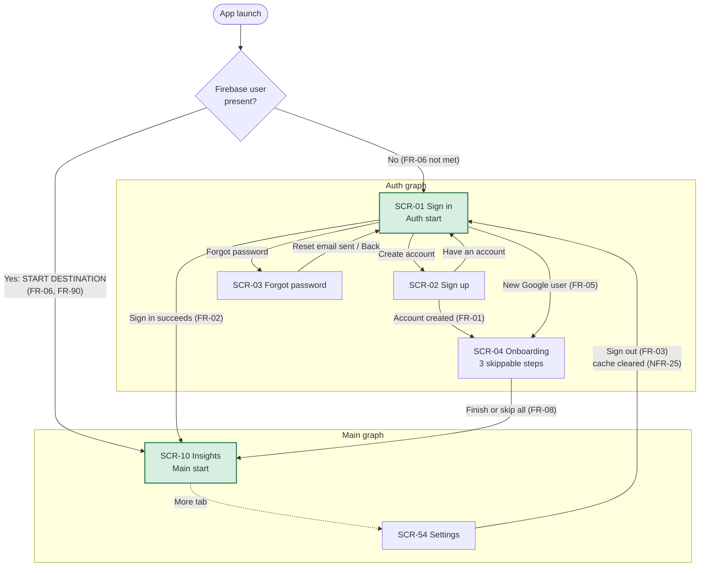
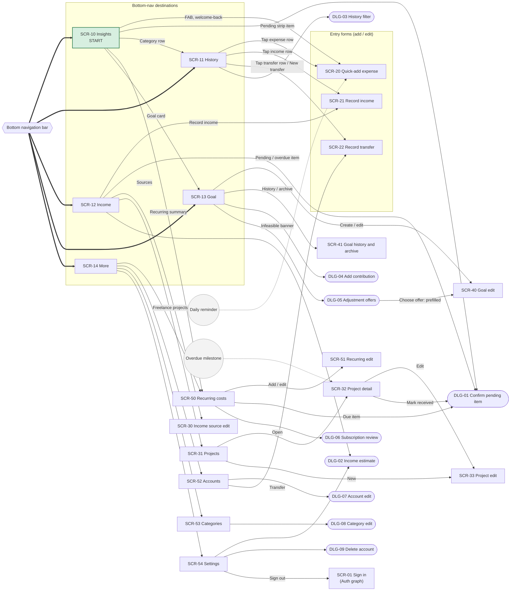

# FundTrail — Screen Inventory and Navigation Map

| | |
|---|---|
| **Product** | FundTrail — personal finance management for Android |
| **Document** | `Docs/ux/screens.md` |
| **Version / status** | 1.0 — Draft for team review |
| **Date** | 2026-10-07 |
| **Issue** | EPIC-002 / T1 · Parent: #9 |
| **Built on** | `Docs/Srs.md` v1.1 (FR, NFR, CON, BR and D identifiers are cited as defined there) |
| **Consumed by** | EPIC-006 / T3 — the `NavHost` is built against section 5 of this document |

**How to use this document.** Every screen has a stable ID. `SCR-xx` is a full-screen destination. `DLG-xx` is a dialog or bottom sheet that sits on top of a screen. IDs are never reused or renumbered; a dropped screen is marked `~~struck~~ (withdrawn)`. Each screen lists the FRs it serves, so a requirement can be traced to the screen that satisfies it (section 6 checks this in the other direction).

**Terminology.** The SRS calls the home screen the "dashboard" (FR-90…FR-99) and names its section "Insights". This document uses **Insights** for the screen and the tab label.

---

## 1. Navigation principles

| Principle | Source |
|---|---|
| Single activity. One `NavHost` using Navigation Compose with type-safe (serializable) routes and typed arguments. | CON-03 |
| Screens never call the data layer. They read state from a ViewModel and send events to it. Navigation is triggered by UI events, not by repositories. | CON-04 |
| Recording an expense is one tap from Insights (a FAB) and at most three taps in total. | FR-30, NFR-01 |
| The app opens on Insights when a session exists. There is no splash screen of our own; the Android system splash covers cold start. | FR-06, FR-90 |
| Onboarding is skippable and always ends on a working Insights screen. | FR-08 |
| Back from a non-start tab returns to Insights. Back on Insights leaves the app. | Material navigation guidance |
| No screen shows streaks, missed-day counters or "incomplete" states. | FR-106 |
| Every screen has an empty state, an actionable error with retry, and inline form validation. | FR-111, FR-112, FR-113 |

---

## 2. Structure at a glance

| Item | Decision |
|---|---|
| **Start destination (app)** | A gate evaluated in `MainActivity` before the `NavHost` is composed: **no Firebase user → Auth graph** (starts at SCR-01 Sign in); **user present → Main graph** (starts at SCR-10 Insights). |
| **Start destination (Auth graph)** | SCR-01 Sign in |
| **Start destination (Main graph)** | SCR-10 Insights |
| **Bottom-nav destinations (5)** | SCR-10 Insights · SCR-11 History · SCR-12 Income · SCR-13 Goal · SCR-14 More |
| **Where the bottom bar shows** | Only on the five tab screens. It is hidden on entry forms, detail screens and dialogs. |
| **Add expense** | FAB on SCR-10 Insights (and a welcome-back action), opening SCR-20 with the amount field focused. |
| **Leaving the Auth graph** | `popUpTo(Auth) { inclusive = true }`, so Back from Insights never returns to sign-in. |
| **Sign-out** | From SCR-54 Settings: clear the local cache (NFR-25), then `popUpTo(Main) { inclusive = true }` and navigate to SCR-01. |
| **Tab switching** | `launchSingleTop`, `restoreState`, `saveState`, popping to the Main graph's start destination. Each tab keeps its own back stack. |
| **Deep links (notifications)** | Daily reminder → SCR-20 (FR-40). Overdue milestone → SCR-32 for that project (FR-53). |

---

## 3. Navigation diagrams

### 3.1 Auth flow and start destination

### 3.2 Main graph, bottom navigation and drill-downs

Bold arrows are the bottom-navigation bar. Rounded boxes are dialogs and sheets. Entry screens return to the screen that opened them.

---

## 4. Screen inventory

**Type:** *Tab* = bottom-nav destination · *Screen* = full-screen destination · *Dialog* = dialog or bottom sheet.
Where an FR is shared by two screens, the one that owns the main interaction is listed first in section 6.

### 4.1 Authentication and onboarding (Auth graph)

| ID | Screen | Type | Purpose | Main content and actions | FRs served |
|---|---|---|---|---|---|
| SCR-01 | Sign in | Screen (Auth start) | Let a returning user into their data. | Email and password fields; Sign in; Google button (Could); links to Sign up and Forgot password. A wrong password shows an error and keeps the email entered. | FR-02, FR-05, FR-111, FR-113 |
| SCR-02 | Sign up | Screen | Create a new account. | Email, password, confirm password; Create account; Google button; link to Sign in. Duplicate or invalid email shows a specific message. Success opens SCR-04. | FR-01, FR-05, FR-113 |
| SCR-03 | Forgot password | Screen | Request a password-reset email. | Email field; Send reset email; confirmation message; Back to Sign in. | FR-04, FR-113 |
| SCR-04 | Onboarding | Screen | Capture the minimum setup in at most three steps, each skippable. | **Step 1 Goal:** name, target, deadline, amount saved. **Step 2 Accounts:** the five defaults, rename or archive. **Step 3 Income:** monthly estimate (low–high) and the four suggested sources. Skip on every step; Finish always lands on SCR-10. | FR-08, FR-10, FR-11, FR-45, FR-46, FR-58, FR-75 |

### 4.2 Bottom-nav destinations (Main graph)

| ID | Screen | Type | Purpose | Main content and actions | FRs served |
|---|---|---|---|---|---|
| SCR-10 | Insights | Tab (Main start) | Answer "where do I stand?" the moment the app opens. | Month switcher; summary (received, spent, saved); goal progress card (required vs actual saving, status, gap); committed vs discretionary split; ranked category breakdown; recurring-costs summary; pending strip (expected salary, overdue milestones, due recurring items, one tap to confirm); sync indicator; FAB for quick-add; neutral welcome-back banner after 7 or more days with no entry. Useful with a single entry. | FR-30, FR-56, FR-90, FR-91, FR-92, FR-93, FR-94, FR-95, FR-97, FR-98, FR-99, FR-105 |
| SCR-11 | History | Tab | Find, check and correct any past record. | All transactions newest first, grouped by day, paged by 50; rows show type, amount, category or source, and account; transfers have a distinct style. Search by note or merchant; filter button opens DLG-03. Tap a row to edit; delete with an undo snackbar. Action to add a transfer. | FR-37, FR-61, FR-100, FR-101, FR-102 |
| SCR-12 | Income | Tab | Show what has actually arrived against what is expected. | This-month received, trailing 3-month average and 6-month range; the user's own estimate beside the computed one; income by source for the selected month; crypto year-to-date net; pending, expected and overdue items kept separate from received; entry points to sources, freelance projects and Record income. | FR-45, FR-49, FR-54, FR-55, FR-56, FR-57, FR-58, FR-59 |
| SCR-13 | Goal | Tab | Show feasibility of the one active goal, with no judgement. | Goal card: target, saved, deadline; required monthly saving; saving pace; status (ahead, on track, behind) with the LKR-per-month gap; projected completion date, or "no projection yet" when pace is zero or less; infeasible banner with adjustment offers; contributions list and Add contribution; crypto include/exclude toggle; Mark reached; links to Edit and History. | FR-75, FR-76, FR-77, FR-78, FR-79, FR-80, FR-81, FR-83, FR-84 |
| SCR-14 | More | Tab | Hold the less frequent areas so the bar stays at five items. | List: Recurring costs, Accounts, Categories, Settings. | none directly (navigation hub) |

### 4.3 Entry forms and confirmation

| ID | Screen | Type | Purpose | Main content and actions | FRs served |
|---|---|---|---|---|---|
| SCR-20 | Quick-add expense | Screen (add and edit) | Log a spend in seconds. | Amount focused with numeric keypad; category chips ordered by recent use, with the suggestion pre-selected and one tap to change it; date and time (defaults to now, back-dating allowed); account (defaults to last used); optional note or merchant; optional expense-type override; optional foreign-currency block (original amount, LKR value, derived rate). Save; Save and add another (keeps date and account). Only the amount is required, so a missing category saves as Uncategorised. On saving a discretionary expense, a neutral goal-cost message appears. | FR-22, FR-23, FR-24, FR-25, FR-30, FR-31, FR-32, FR-33, FR-35, FR-36, FR-37, FR-38, FR-41, FR-113 |
| SCR-21 | Record income | Screen (add and edit) | Record received money from any source. | Source picker; original currency and amount; LKR received; derived rate (never recomputed); date; account. Crypto sources take a signed gain or loss. AdSense can be saved as a pending estimate that counts as zero. | FR-45, FR-47, FR-54, FR-55, FR-113 |
| SCR-22 | Record transfer | Screen (add and edit) | Move money between the user's own accounts without distorting totals. | From account, to account, amount, date. Same from and to is rejected with a message. Moves into or out of Binance use this form. | FR-60, FR-61, FR-62, FR-113 |
| DLG-01 | Confirm pending item | Dialog | Turn an expected item into a received or actual one with one confirmation. | Shows the expected amount; the actual amount is editable; date and account; shows the variance (actual − expected). Used for expected salary, a pending AdSense estimate, a freelance milestone marked received (linked to its project and milestone) and a due recurring item. | FR-49, FR-52, FR-54, FR-66, FR-67, FR-99 |
| DLG-03 | History filter | Dialog (bottom sheet) | Narrow the history list. | Type, account, category, source, date range; Apply and Clear. | FR-101 |

### 4.4 Income area

| ID | Screen | Type | Purpose | Main content and actions | FRs served |
|---|---|---|---|---|---|
| SCR-30 | Income source edit | Screen (add and edit) | Define where money comes from. | Name, type (salary, freelance, AdSense, crypto, other), cadence, currency, optional expected amount, optional expected day. | FR-45 |
| SCR-31 | Freelance projects | Screen | List projects and their payment status. | Projects with total agreed and a status chip per milestone (pending, overdue, received); New project. | FR-50, FR-51, FR-56 |
| SCR-32 | Project detail | Screen | Track one project's milestones and chase unpaid ones. | Project name, client, total agreed; milestones with amount, due date and status; Mark received (opens DLG-01, creates the linked income entry); Edit. Target of the overdue-milestone notification. | FR-50, FR-51, FR-52, FR-53 |
| SCR-33 | Project edit | Screen (add and edit) | Create or change a project and its milestones. | Name, optional client, total agreed, milestone rows (amount, due date); add and remove rows. | FR-50 |
| DLG-02 | Income estimate | Dialog | Let the user state their own expected monthly income. | Low and high values, shown beside the computed figure on SCR-12. Opened from SCR-12 and SCR-54. | FR-58, FR-115 |

### 4.5 Goal area

| ID | Screen | Type | Purpose | Main content and actions | FRs served |
|---|---|---|---|---|---|
| SCR-40 | Goal edit | Screen (create and edit) | Create the goal or change its target or deadline without losing progress. | Name, target (LKR), deadline, amount already saved; live preview of the required monthly saving. Accepts values prefilled from an adjustment offer. Saving an edit to target or deadline logs the old value. | FR-75, FR-76, FR-81, FR-82 |
| SCR-41 | Goal history and archive | Screen | Show how the goal changed and what has been reached. | Revision history (old and new target or deadline, date); archived goals; Create a new goal once the last one is archived. | FR-82, FR-84 |
| DLG-04 | Add contribution | Dialog | Earmark money to the goal. | Amount and date. Raises *saved*; does not change net saving. | FR-80 |
| DLG-05 | Goal adjustment offers | Dialog (bottom sheet) | Present the two adjustments when the goal is infeasible. | (a) new deadline; (b) reduced target; Edit manually; Dismiss. Choosing an offer opens SCR-40 prefilled. | FR-81 |

### 4.6 Recurring costs, accounts, categories and settings (reached from More)

| ID | Screen | Type | Purpose | Main content and actions | FRs served |
|---|---|---|---|---|---|
| SCR-50 | Recurring costs | Screen | See every recurring cost and confirm what is due. | Templates with expected amount, cadence, next due day and a combined monthly total; due items with one-tap confirm (DLG-01); history showing expected vs actual with the variance; pause or end a template; subscription-review prompts. | FR-65, FR-66, FR-67, FR-68, FR-69, FR-70 |
| SCR-51 | Recurring edit | Screen (add and edit) | Create or change a recurring template. | Name, category, expected amount, cadence (weekly, monthly, yearly), due day, account, type; Pause; End. | FR-65, FR-70 |
| DLG-06 | Subscription review | Dialog | Ask "still using this?" every 90 days, without pressure. | Keep, Remind me to cancel, End. *End* stops future prompts and keeps history. | FR-69 |
| SCR-52 | Accounts | Screen | Manage the user's pots and see each balance. | The five defaults plus any added; balance per account (opening balance + income − expenses ± transfers); add, rename, archive (archived accounts leave entry forms but keep history); Transfer action. | FR-10, FR-11, FR-12, FR-60 |
| DLG-07 | Account edit | Dialog | Add or rename an account. | Name, kind, optional opening balance, archive. | FR-11 |
| SCR-53 | Categories | Screen | Manage categories and their committed or discretionary type. | Seeded and custom categories grouped by type; change a category's type; add, rename, archive. | FR-20, FR-21, FR-22 |
| DLG-08 | Category edit | Dialog | Add or change one category. | Name, default type, archive. | FR-21, FR-22 |
| SCR-54 | Settings | Screen | Hold preferences and account-level actions. | Daily reminder time (off by default); income estimate (opens DLG-02); subscription-review interval; include crypto in goal projection (default off); export all records as CSV; delete account and data; sign out. The theme follows the system setting, so there is no theme switch. | FR-03, FR-40, FR-58, FR-69, FR-83, FR-115, FR-116, FR-118 |
| DLG-09 | Delete account | Dialog | Confirm the irreversible delete of the account and all its data. | Plain-language consequence; Cancel; Delete. After deletion the user returns to SCR-01. | FR-117 |

### 4.7 Behaviour that belongs to no single screen

These FRs are met by shared components or by the data layer, so they appear in every relevant screen's design rather than as a destination.

| Concern | FRs | How it is met in the UI |
|---|---|---|
| Session gate | FR-06 | The start-destination gate in section 2. |
| Per-user data scope | FR-07 | Data layer. No UI. |
| Default data seeding | FR-10, FR-20 | First sign-in creates the five accounts and the Appendix A categories. They are then visible in SCR-52 and SCR-53. |
| Record structure and stored values | FR-34, FR-48 | Data layer. The forms only supply the fields. |
| Offline entry | FR-39 | Every form saves locally first and never blocks on the network. |
| Real-time updates | FR-96 | SCR-10 collects `StateFlow` backed by a listener per month window. |
| Sync indicator | FR-110 | A small offline, syncing or synced indicator in the top bar of the tab screens. |
| Errors, empty states, validation | FR-111, FR-112, FR-113 | Shared error component with Retry; every list and chart has an empty state; inline messages on every form. |
| Neutral tone, no streaks | FR-105, FR-106, NFR-14 | Copy review across every screen. The welcome-back banner is part of SCR-10. |
| Overdue-milestone reminder | FR-53 | A local notification that deep-links to SCR-32. |

---

## 5. Route table for the NavHost (EPIC-006 / T3)

Routes are `@Serializable` types. Optional arguments default to `null`; a `null` id means "create". Nested graphs are `Auth` and `Main`.

| Graph | Route | Screen / dialog | Arguments | Entered from |
|---|---|---|---|---|
| Auth | `SignIn` (start) | SCR-01 | none | Gate; Sign up; Forgot password; sign-out; delete account |
| Auth | `SignUp` | SCR-02 | none | SCR-01 |
| Auth | `ForgotPassword` | SCR-03 | none | SCR-01 |
| Auth | `Onboarding` | SCR-04 | none | SCR-02; new Google user at SCR-01 |
| Main | `Insights` (start, tab) | SCR-10 | none | Gate; SCR-01; SCR-04; bottom bar |
| Main | `History` (tab) | SCR-11 | `categoryId: String? = null` | Bottom bar; SCR-10 category row |
| Main | `Income` (tab) | SCR-12 | none | Bottom bar |
| Main | `Goal` (tab) | SCR-13 | none | Bottom bar; SCR-10 goal card |
| Main | `More` (tab) | SCR-14 | none | Bottom bar |
| Main | `QuickAdd` | SCR-20 | `transactionId: String? = null` | SCR-10 FAB; SCR-11; reminder deep link |
| Main | `RecordIncome` | SCR-21 | `transactionId: String? = null`, `sourceId: String? = null` | SCR-12; SCR-11 |
| Main | `RecordTransfer` | SCR-22 | `transactionId: String? = null` | SCR-11; SCR-52 |
| Main | `ConfirmPending` (dialog) | DLG-01 | `kind: PendingKind` (`SALARY`, `ADSENSE`, `MILESTONE`, `RECURRING`), `itemId: String` | SCR-10 strip; SCR-12; SCR-32; SCR-50 |
| Main | `HistoryFilter` (dialog) | DLG-03 | none (state held in the History ViewModel) | SCR-11 |
| Main | `IncomeSourceEdit` | SCR-30 | `sourceId: String? = null` | SCR-12 |
| Main | `Projects` | SCR-31 | none | SCR-12 |
| Main | `ProjectDetail` | SCR-32 | `projectId: String` | SCR-31; overdue-milestone deep link |
| Main | `ProjectEdit` | SCR-33 | `projectId: String? = null` | SCR-31; SCR-32 |
| Main | `IncomeEstimate` (dialog) | DLG-02 | none | SCR-12; SCR-54 |
| Main | `GoalEdit` | SCR-40 | `goalId: String? = null`, `prefillTarget: Long? = null`, `prefillDeadline: Long? = null` | SCR-13; DLG-05 |
| Main | `GoalHistory` | SCR-41 | none | SCR-13 |
| Main | `AddContribution` (dialog) | DLG-04 | `goalId: String` | SCR-13 |
| Main | `GoalOffers` (dialog) | DLG-05 | `goalId: String` | SCR-13 |
| Main | `Recurring` | SCR-50 | none | SCR-14; SCR-10 recurring summary |
| Main | `RecurringEdit` | SCR-51 | `templateId: String? = null` | SCR-50 |
| Main | `SubscriptionReview` (dialog) | DLG-06 | `templateId: String` | SCR-50 |
| Main | `Accounts` | SCR-52 | none | SCR-14 |
| Main | `AccountEdit` (dialog) | DLG-07 | `accountId: String? = null` | SCR-52 |
| Main | `Categories` | SCR-53 | none | SCR-14 |
| Main | `CategoryEdit` (dialog) | DLG-08 | `categoryId: String? = null` | SCR-53 |
| Main | `Settings` | SCR-54 | none | SCR-14 |
| Main | `DeleteAccount` (dialog) | DLG-09 | none | SCR-54 |

Notes for the build:
- Money amounts passed as arguments are integer minor units (BR-02). Prefer ids over objects; ViewModels load the record by id.
- The bottom bar is shown when the current destination is one of the five tab routes, and hidden otherwise.
- All back-stack rules in section 2 apply. In particular, sign-out and delete-account clear the whole Main graph.

---

## 6. Requirement coverage

Every functional requirement in the SRS maps to a screen in section 4 or to a shared behaviour in section 4.7.

| SRS section | FRs | Served by |
|---|---|---|
| 5.1 Authentication and onboarding | FR-01, FR-02, FR-03, FR-04, FR-05, FR-06, FR-07, FR-08 | SCR-02, SCR-01, SCR-54, SCR-03, SCR-01/02, gate, data layer, SCR-04 |
| 5.2 Accounts | FR-10, FR-11, FR-12 | SCR-52, DLG-07, SCR-04 |
| 5.3 Categories | FR-20, FR-21, FR-22, FR-23, FR-24, FR-25 | SCR-53, DLG-08, SCR-20 |
| 5.4 Expense entry | FR-30, FR-31, FR-32, FR-33, FR-34, FR-35, FR-36, FR-37, FR-38, FR-39, FR-40, FR-41 | SCR-20 (FR-37 also SCR-11; FR-40 in SCR-54; FR-34 and FR-39 cross-cutting) |
| 5.5 Income | FR-45, FR-46, FR-47, FR-48, FR-49, FR-50, FR-51, FR-52, FR-53, FR-54, FR-55, FR-56, FR-57, FR-58, FR-59 | SCR-30, SCR-04, SCR-21, DLG-01, SCR-31/32/33, SCR-12, DLG-02 |
| 5.6 Transfers | FR-60, FR-61, FR-62 | SCR-22 (FR-61 also SCR-11) |
| 5.7 Recurring costs | FR-65, FR-66, FR-67, FR-68, FR-69, FR-70 | SCR-50, SCR-51, DLG-01, DLG-06 |
| 5.8 Savings goal | FR-75, FR-76, FR-77, FR-78, FR-79, FR-80, FR-81, FR-82, FR-83, FR-84 | SCR-13, SCR-40, SCR-41, DLG-04, DLG-05 (FR-83 also SCR-54) |
| 5.9 Insights | FR-90, FR-91, FR-92, FR-93, FR-94, FR-95, FR-96, FR-97, FR-98, FR-99 | SCR-10 |
| 5.10 History | FR-100, FR-101, FR-102 | SCR-11, DLG-03 |
| 5.11 Gap tolerance | FR-105, FR-106 | SCR-10 banner; all screens |
| 5.12 Reliability, errors and settings | FR-110, FR-111, FR-112, FR-113, FR-115, FR-116, FR-117, FR-118 | Shared components (section 4.7); SCR-54, DLG-09 |

The use cases in SRS section 2.3 map to screens as follows.

| UC | Primary screens |
|---|---|
| UC-01 Quick-add expense | SCR-10 → SCR-20 |
| UC-02 Confirm salary received | SCR-10 strip or SCR-12 → DLG-01 |
| UC-03 Track freelance milestone | SCR-12 → SCR-31 → SCR-32 → DLG-01 |
| UC-04 Record AdSense payout | SCR-12 → SCR-21, or DLG-01 to confirm an estimate |
| UC-05 Record crypto result | SCR-12 → SCR-21 |
| UC-06 Record transfer | SCR-11 or SCR-52 → SCR-22 |
| UC-07 Check dashboard | SCR-10 |
| UC-08 Manage MacBook goal | SCR-13 → SCR-40, DLG-04, DLG-05 |
| UC-09 Review recurring costs | SCR-14 → SCR-50 → DLG-01, DLG-06 |
| UC-10 Catch up after a gap | SCR-10 banner → SCR-20 (Save and add another) |
| UC-11 Sign up / sign in | SCR-01, SCR-02, SCR-04 |

---

## 7. Decisions and open points for review

| ID | Point | Proposal | Why |
|---|---|---|---|
| UX-01 | Where should the app decide between Auth and Main? | A gate before the `NavHost` reads the Firebase user and picks the start graph. No Splash destination. | Avoids a flash of the wrong screen and matches FR-06 "open straight to the dashboard". |
| UX-02 | How many bottom-nav items? | Five: Insights, History, Income, Goal, More. | Material 3 allows three to five. Recurring, Accounts, Categories and Settings are used less often than the four daily areas. |
| UX-03 | How are income and transfers entered, given that the FAB is for expenses? | The FAB opens quick-add only. Income is entered from SCR-12, transfers from SCR-11 and SCR-52. | Keeps NFR-01 (three taps for the most frequent action) without a speed-dial menu. |
| UX-04 | Should Sign in resume an unfinished onboarding? | No. Onboarding follows account creation only (FR-01). A user who leaves it early lands on Insights with empty-state prompts (FR-08). | Keeps onboarding free of state and consistent with "reach the dashboard even if every step is skipped". |
| UX-05 | Dialogs vs destinations | Small confirm and edit forms (DLG-xx) are `dialog` destinations, so they are deep-linkable and survive rotation. | NFR-17 requires rotation not to crash. |
| UX-06 | Is the tab layout needed for a tablet? | No, phones in portrait only. | SRS section 1.3 puts tablet layouts out of scope. |

---

## Change log

| Version | Date | Change |
|---|---|---|
| 1.0 | 2026-10-07 | First draft: screen inventory, auth and main navigation diagrams, route table and FR coverage. |
